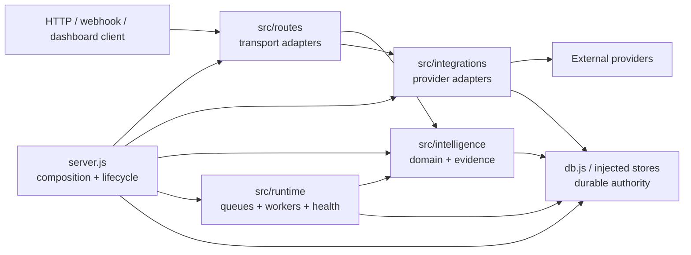
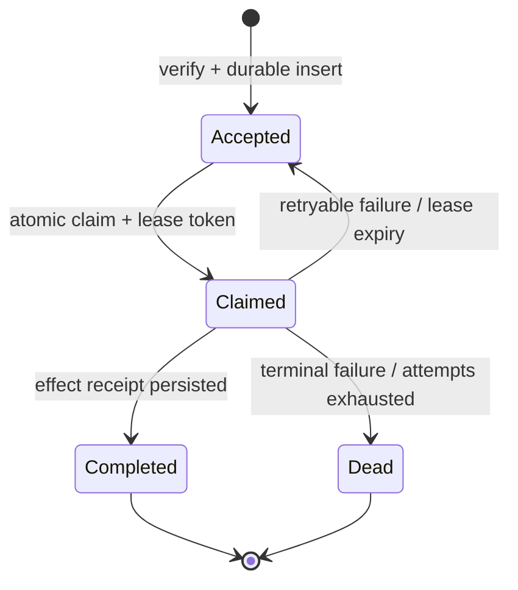

# pm-agent architecture

## Status and direction

pm-agent is a CommonJS Node.js modular monolith. It is in a transitional state: `server.js`,
`db.js`, `src/intelligence/store.js`, and several other modules still contain substantial legacy
implementation. The target is a thin composition root around explicit route, integration,
intelligence, runtime, and persistence seams.

The transition uses a ratchet:

1. existing oversized modules have frozen line and byte ceilings;
2. new routes are forbidden in `server.js`;
3. new modules stay below the default size budget;
4. each feature change extracts a coherent capability behind an injected interface;
5. ceilings are reduced after extraction and are not raised for convenience.

`architecture-boundaries.json` is the machine-readable budget. `scripts/check-architecture.js`
enforces it and the dependency rules described below. `AGENTS.md` is the canonical contributor
checklist.

## Logical components



The arrows show calls after assembly, not permission to reach back into `server.js`. Dependencies
are passed as narrow functions or service objects. A module under `src/` never imports the
composition root or the root database module.

### Composition root: `server.js`

Allowed responsibilities:

- load and validate process configuration;
- construct stores, provider adapters, monitors, and workers;
- inject dependencies into route factories and runtime services;
- register process signal/startup/shutdown behavior;
- export the assembled app/runtime for compatibility while legacy tests are migrated.

Disallowed new responsibilities:

- `app.get/post/put/patch/delete` declarations;
- business or evidence rules;
- SQL/persistence algorithms;
- provider payload parsing and signature policy;
- queue, retry, or worker implementations.

The current inline-route count is legacy debt recorded in the boundary file. Move an entire route
family to a factory and lower that count when touching the family.

### HTTP adapters: `src/routes/`

Each module exports a named factory:

```js
function registerWidgetRoutes(app, {
  requireAuth,
  widgetService,
}) {
  app.post('/widgets', requireAuth, async (req, res) => {
    const input = parseWidget(req.body);
    const result = await widgetService.create(input);
    res.status(201).json(result);
  });
}

module.exports = { registerWidgetRoutes };
```

Handlers own transport concerns: auth middleware ordering, parsing, validation, HTTP status, and
response shape. They call injected operations and return promptly. They do not own provider
protocols, durable work algorithms, or long-running execution.

When moving a legacy route, preserve its path, middleware order, request/response contract, and
failure behavior. Update `test/fixtures/routes.txt` and contract tests only when the public API
actually changes.

### Provider adapters: `src/integrations/`

Integration modules translate between an external protocol and provider-neutral operations. They
own such concerns as raw webhook verification, provider event IDs, pagination/cursors, rate-limit
signals, deadlines, provider receipts, and error classification.

Integrations do not register routes and do not import domain/runtime implementations. The
composition root injects the domain operation, durable inbox/outbox, clock, HTTP client, and
configuration. This keeps provider behavior independently testable and prevents domain code from
depending on a Slack, Recall, Drive, or model-vendor payload.

### Domain and evidence: `src/intelligence/`

Intelligence modules own decisions, models, evidence normalization, forecasts, projections, and
provider-neutral transformations. Prefer pure functions and explicit clock/random/provider inputs.
They must not import route or integration modules.

`src/intelligence/store.js` still coordinates substantial legacy state and uses runtime serializers.
That is a documented transition seam, not a pattern for new features. New capabilities should have
focused stores/services whose persistence and scheduling dependencies are injected.

### Runtime: `src/runtime/`

Runtime modules own scheduling, cancellation, queues, worker leases, health, resource monitoring,
and shutdown coordination. They may run intelligence operations but do not shape HTTP responses.
All recurring work is assumed to run on more than one replica; a local timer may trigger a claim,
but durable state decides which replica owns it.

### Supporting seams

`src/middleware/` owns reusable HTTP authentication/authorization and request policy.
`src/mcp/`, `src/governance/`, and `src/gifting/` contain focused application or protocol
capabilities that obey the same injection and durability rules. `src/lib/` is reserved for small,
dependency-light utilities that are genuinely shared; it is not a destination for feature policy.

### Persistence

The database is the authority for externally meaningful state. `db.js` is a legacy adapter and
composition dependency. New modules receive narrow persistence operations instead of importing it.
Writes use parameterized input, constraints/transactions for invariants, and explicit state
transitions.

## Durable external-effect protocol

Webhook intake and deferred effects follow this state machine:



Required invariants:

- `(provider, event_id)` or an equivalent idempotency key is durably unique.
- The HTTP acknowledgement happens after `Accepted`, never merely after an in-memory enqueue.
- Claim and lease extension are atomic. Completion includes the current claim/fencing token.
- A stale worker cannot complete or fail a claim owned by a newer attempt.
- Retry classification, attempt count, next-attempt time, result/receipt, and terminal error are
  persisted.
- Per-conversation ordering is enforced durably when order changes meaning.
- Outbound requests carry a stable idempotency key whenever the provider supports one.
- Timers, maps, and process-local queues are performance aids only; restart does not lose work.

For synchronous external effects, the request still uses bounded deadlines and an idempotency key,
and stores the authoritative provider receipt before it claims success.

## Evidence model

Canonical records retain:

- source/provider and stable source record or receipt ID;
- observation/event time and ingestion time;
- actor/subject and relevant scope;
- raw or normalized evidence reference;
- provenance/attestation and verification state;
- whether a value is observed, inferred, predicted, contradicted, or unknown.

Derived dashboards, summaries, embeddings, caches, and forecasts are projections. They must be
rebuildable and cannot overwrite canonical evidence. Attempted calls, queued work, model output,
and provider-confirmed outcomes are distinct states.

## Multi-replica correctness

Code must remain correct when two replicas receive the same event or wake for the same schedule.

- Use database uniqueness, transactions, advisory locks, or atomic conditional updates for
  ownership and invariants.
- Use leases with fencing tokens for recoverable work; do not rely on a boolean `busy` flag.
- Store schedule cursors/next-run state durably. Time zones and clock inputs are explicit.
- Make cache invalidation cross-replica or accept bounded staleness only for non-authoritative data.
- Graceful shutdown stops new claims, drains bounded in-flight work, and lets leases recover.
- Health endpoints report durable backlog/oldest age, active leases, retries, and dead work where
  operationally relevant.

## Dependency rules enforced today

- No module under `src/` imports root `server.js` or `db.js`.
- Only modules under `src/routes/` declare Express `app`/`router` route methods.
- Modules outside `src/routes/` do not import route modules.
- `src/intelligence/` does not import `src/integrations/`.
- `src/integrations/` does not import intelligence or runtime implementations.
- A route file with route declarations defines and exports a named `register…Route(s)` factory.

Some legacy intelligence/runtime dependencies remain and are intentionally documented rather than
hidden. Tighten a rule after removing the exception; do not add a new cycle.

## Size budgets

The checker scans root JavaScript entry points and JavaScript under `src/`.

- New/unlisted module: at most 600 physical lines and 60,000 UTF-8 bytes after normalizing line
  endings, so the result is identical on Windows and Unix checkouts.
- Listed legacy module: at most its frozen line and byte ceiling.
- `server.js`: at most the recorded number of inline Express route declarations.

Both line and byte ceilings prevent minification or line packing from replacing actual extraction.
When a listed file shrinks, the checker requires its ceilings to be lowered to the new observed
values. Remove its legacy entry once it fits the defaults. A deliberately generated source file
should be moved to a generation artifact outside the runtime module graph, not exempted casually.

## Verification

Run:

```text
node scripts/check-architecture.js
node --test --test-concurrency=1 test/contract/architecture.test.js
npm test
```

Feature tests additionally cover the applicable boundaries:

- route/auth/validation and public contract;
- domain decisions and evidence states;
- provider verification, deadline, retry, and receipt mapping;
- duplicate event, restart/replay, two-claimant race, lease expiry, stale-token fencing;
- integration assembly and persistence behavior.

A change is not complete merely because its happy path works on one process.
